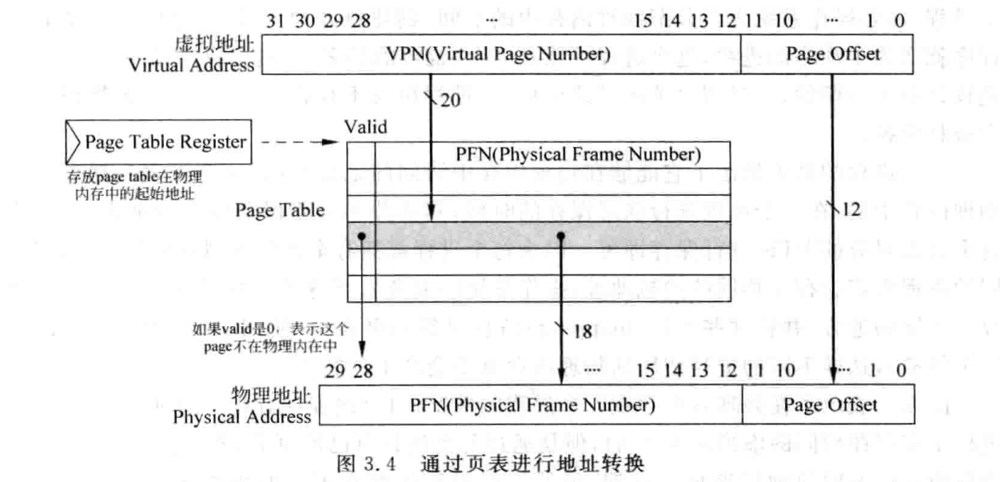
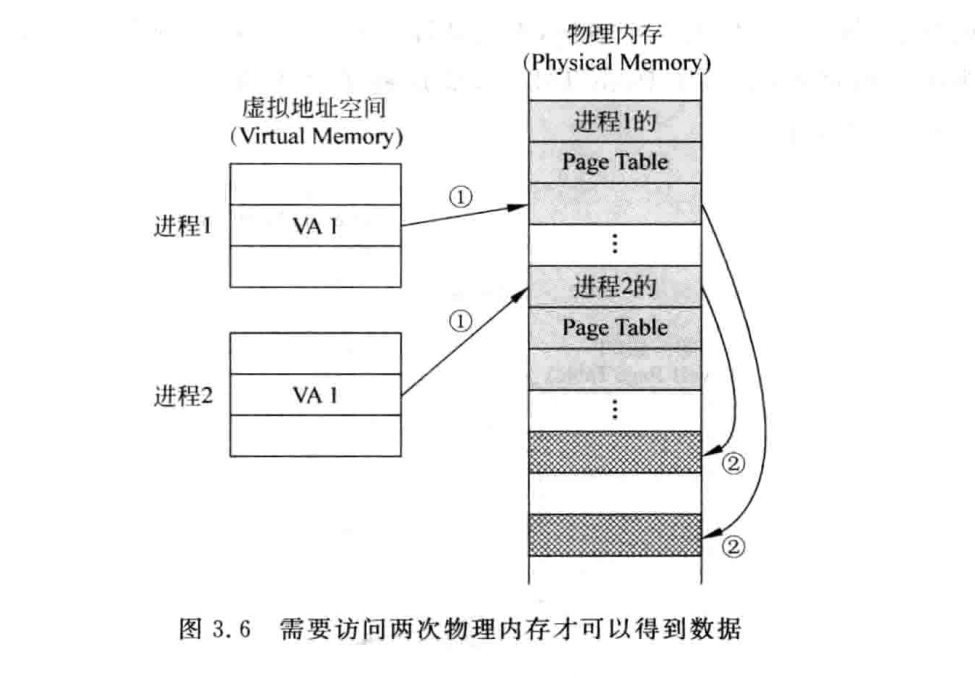
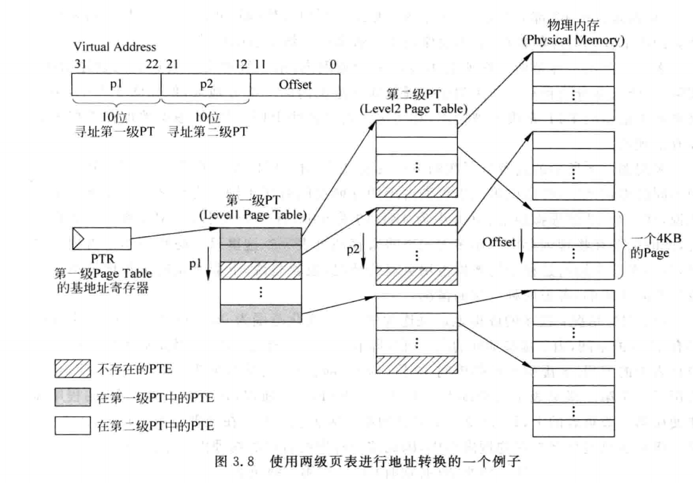

# 超标量处理器设计读书笔记

## 概述-总体架构

## Cache

## 页表及TLB

### 概述

引入虚拟地址，为了解决:
>物理内存较小-动态分配程序所占内存地址空间
>多个程序同时进行时的保护与共享

### 地址转换

一般页`(page)`的大小为`4KB`
**VPN**: (virtual page number) 标志虚拟地址的页序号
**PFN**: (Physical frame number) 标志物理地址的页(帧)序号
**MMU**: (Memory Management Unit)即内存管理单元。它是计算机系统中的一种硬件，负责处理虚拟地址到物理地址的转换。
`VPN`通过`MMU`(页表/TLB)映射至`PFN`

该图表示1GB的物理内存，4KB的页大小的地址转换
通过虚拟地址的VPN访问对应页表，得到PFN，用PFN访问内存
**页替换**: 所需的`VPN`未映射至`PFN`，发生`Page Fault`

### 单级页表

**程序状态**：PC、通用寄存器状态、页表

这样执行一条load需要**两次访问内存**--慢

### 多级页表

单级页表存在的问题：
1. 虚拟地址空间较大时，页表会很大
2. 一个程序的许多页表是空的，都放在内存中太浪费

为解决页表过大占用内存，采用页表分级
> 将较大的线性页表分级，在需要时将相应的页表放入内存
> 
**表项**：页表中的表项简称为`PTE`(Page Tabel Entry),一般指示对应的下一级页表的起始地址或页的起始地址

### TLB

#### 虚拟地址空间与地址翻译模式

##### 地址翻译模式

两种虚实地址翻译模式：
1. 直接地址翻译模式：虚拟地址与物理地址相同；(CPU复位启动后先进入直接地址翻译模式)
2. 映射地址翻译模式：
   1. 直接映射地址翻译模式(直接映射模式)：系统通过配置`CSR.DMW0~CSR.DMW1`寄存器分别设置两个直接映射配置窗口(每个直接映射配置窗口配置一个2^29字节固定大小的虚拟地址空间)，当虚拟地址命中(即虚拟地址最高3位与窗口寄存器的[31:29]相等)，则实际物理地址映射为虚拟地址的[28:0]拼接上窗口寄存器配置的高位(?)
   2. 页表映射地址翻译模式(页表映射模式)：通过页表映射完成虚实地址转换，增加TLB

龙芯架构中，存储访问类型分为：
1. 一致可缓存
2. 强序非缓存(例如外设地址空间)

在直接地址翻译模式时：
* 取指的存储访问类型由`CSR.CRMD.DATF`决定；
* load/store的存储访问类型由`CSR.CRMD.DATM`决定；
在映射地址翻译模式时：
* 若虚拟地址命中直接映射配置窗口，则存储访问类型由`CSR`的`MAT`域决定；
* 否则，通过页表完成映射，存储访问类型由页表的`MAT`域决定。

#### 页表映射存储管理

TLB采用全相联查找表

每个表项格式：

