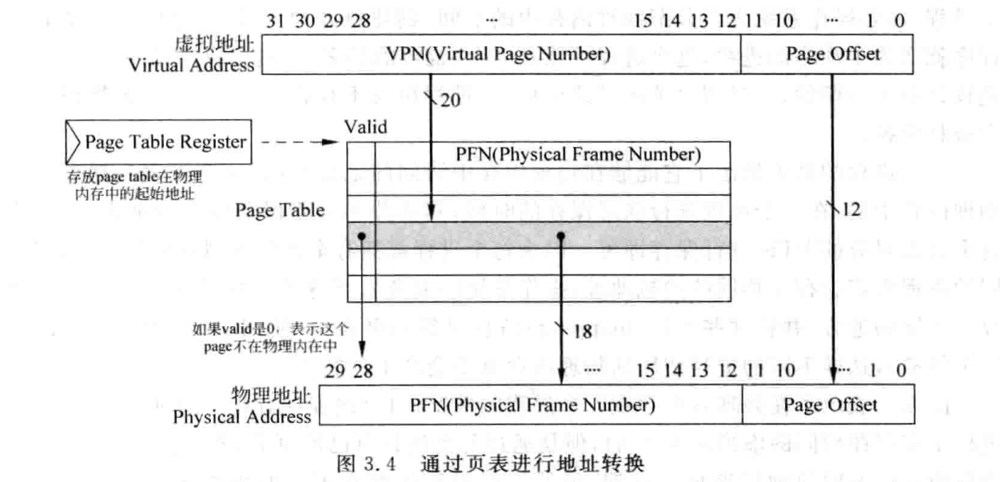
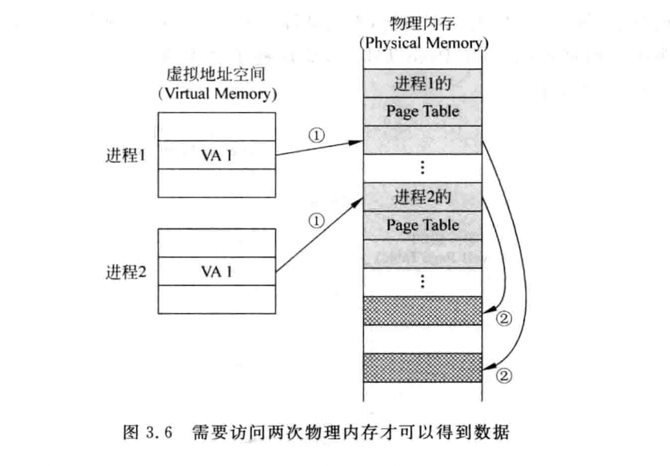
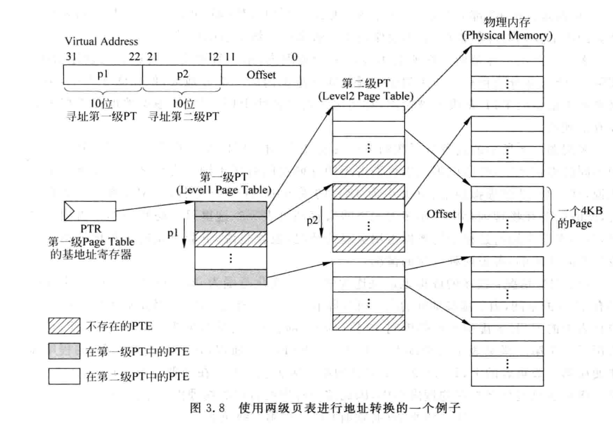

# 超标量处理器设计读书笔记

## 概述-总体架构

## Cache

## 页表及TLB

### 概述

引入虚拟地址，为了解决:
>物理内存较小-动态分配程序所占内存地址空间
>多个程序同时进行时的保护与共享

### 地址转换

一般页`(page)`的大小为`4KB`
**VPN**: (virtual page number) 标志虚拟地址的页序号
**PFN**: (Physical frame number) 标志物理地址的页(帧)序号
**MMU**: (Memory Management Unit)即内存管理单元。它是计算机系统中的一种硬件，负责处理虚拟地址到物理地址的转换。
`VPN`通过`MMU`(页表/TLB)映射至`PFN`

该图表示1GB的物理内存，4KB的页大小的地址转换
通过虚拟地址的VPN访问对应页表，得到PFN，用PFN访问内存
**页替换**: 所需的`VPN`未映射至`PFN`，发生`Page Fault`

### 单级页表

**程序状态**：PC、通用寄存器状态、页表

这样执行一条load需要**两次访问内存**--慢

### 多级页表

单级页表存在的问题：
1. 虚拟地址空间较大时，页表会很大
2. 一个程序的许多页表是空的，都放在内存中太浪费

